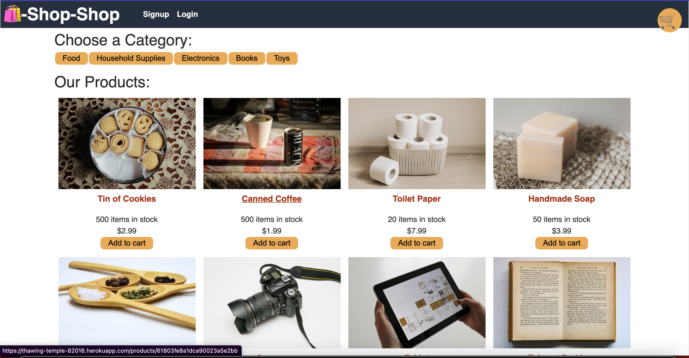
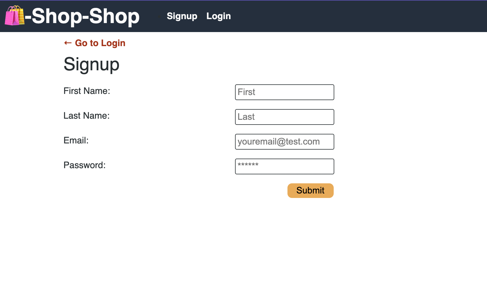
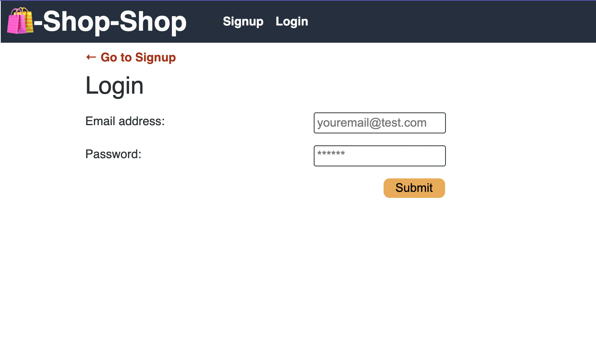
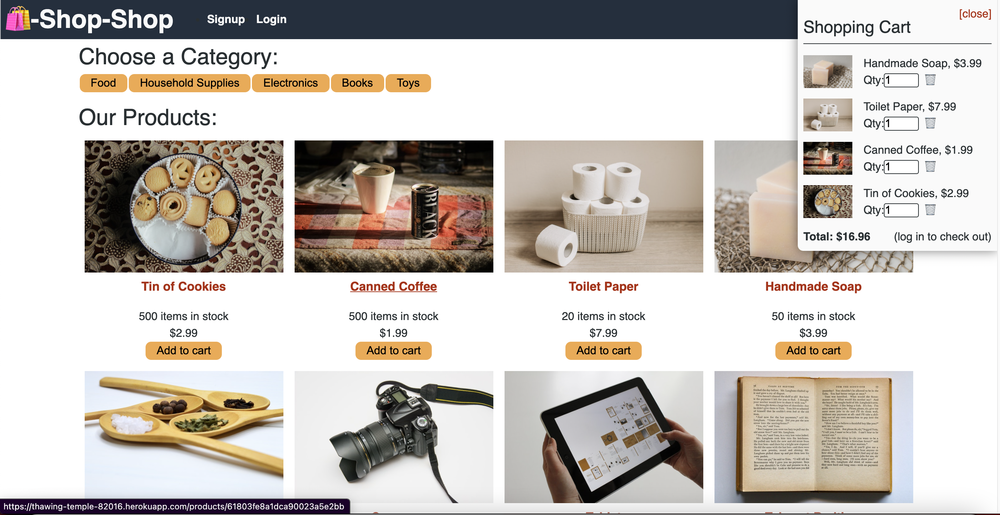

# Redux-Work

[](https://opensource.org/licenses/MIT)

For this assignment, the app is a Shopping site!  In this the challenge is to connect the included frontend with a backend that is to be built using MongoDB, Mongoose and Express.

## Table of Contents

  - [Table of Contents](#table-of-contents)
  - [Installation](#installation)
  - [Usage](#usage)
  - [Features](#features)
  - [License](#license)
  - [Contributing](#contributing)
  - [Screenshots](#screenshots)
  - [Questions](#questions)

## Installation
1. Clone this GitHub repository

   ```
    git@github.com:mvint2647/Redux-Work.git
   ```


2. Install all dependent npm packages

   ```
   npm install --save
   ```
3. Create a MongoDB database
4. If running locally update the MONGODB_URI with your connection string in a .env file
5. If running on a server or hosting platform add the MONGODB_URI with connection string to the environment variables
6. If needed seed the MongoDB database by running `npm run seed`


## Usage
1. Run `npm start` to start the application
2. Choose **Login** to continue shopping or **Signup** to create a userpage.
3. At **Add Your Item**  select your **Checkout**
4. Enter the details of your Payment Info **Subitmit Payment** to complete the Payment or **Add Another Item** continue to add other items from the page!


A demo of the application is available at: https://thawing-temple-82016.herokuapp.com
## Features
* Add an Item
* Signup
* Login
* Purchase an Item
* Browse through Items


## License
This project uses the MIT license
## Contributing
Pull requests are welcome
## Screenshots
**Home Page**








## Questions
Checkout my GitHub [profile](https://github.com/mvint2647)

Please feel free to email at: <Melissavinny1133@gmail.com>